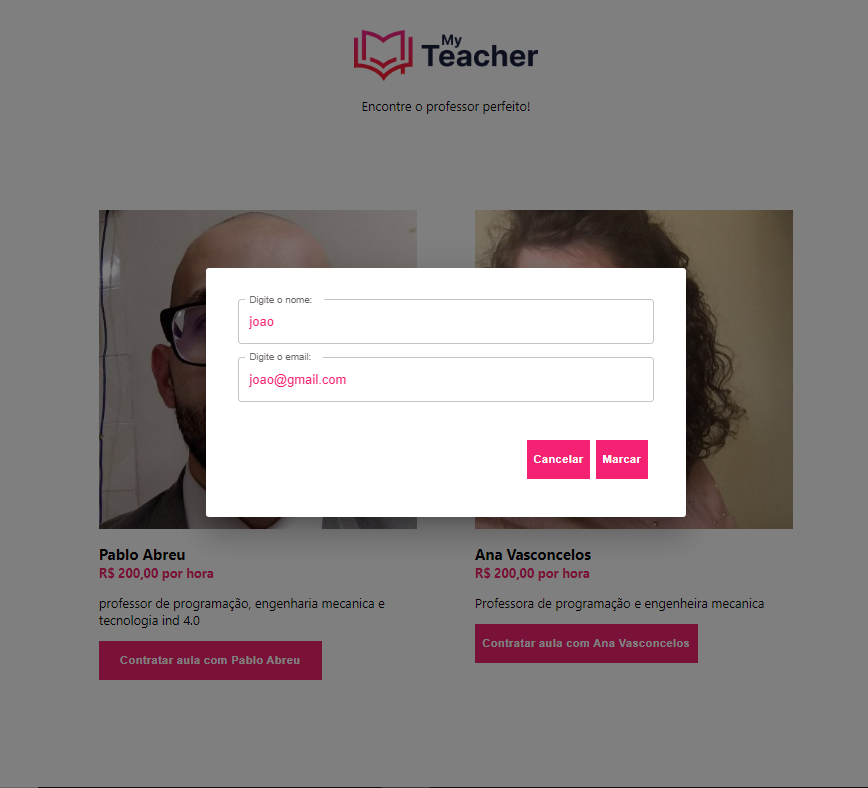
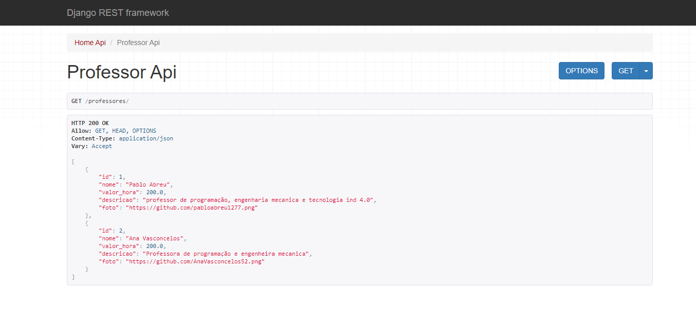
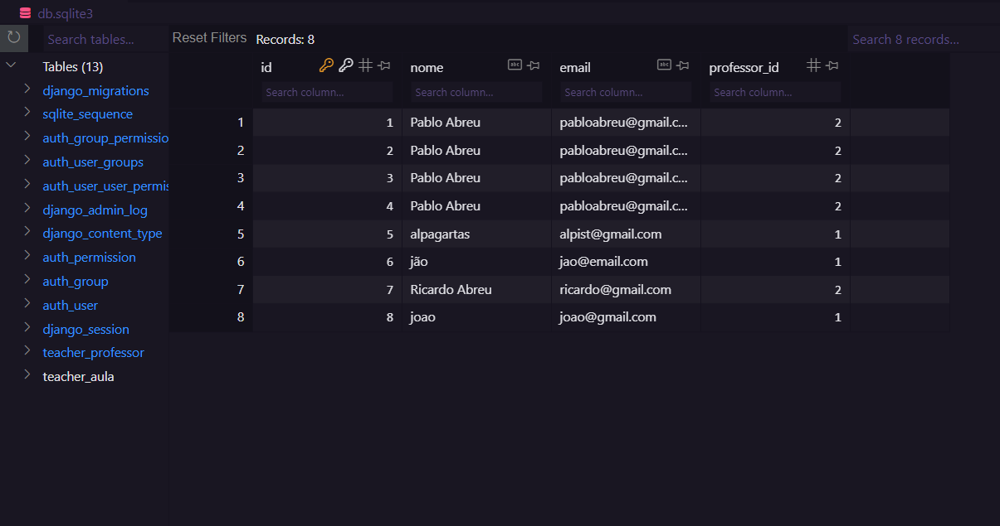

# React-Python-TreinaWeb-Principal - Projeto Final
Intensivo semana React da treinaWeb para desenvolvimento web.Veja o resultado do Front-End elaborado:

 
  
 
    
    
    
    

 
  Veja o desenvolvimento da API usando o framework Django:
  
 
    
    
